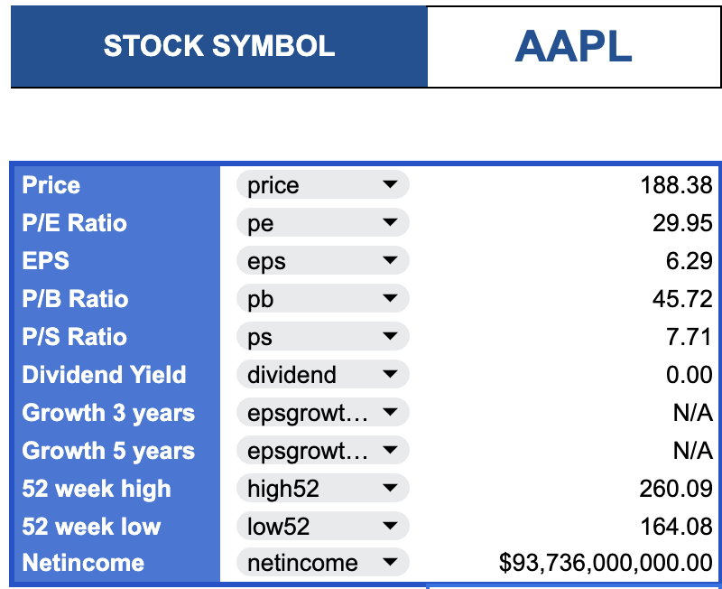

## Stocks sheet
### Purpose:
Combine a few stock API data sources into a single sheet for easy access and analysis.
### How to use:  
1. Create a new Google Sheet or Make a copy of the template: https://docs.google.com/spreadsheets/d/1bMvc8AxuXq8QDmtlk5slr4yPsYkustTcV2s8Ue6RLvE/edit?usp=sharing
2. Go to the `Extensions` menu, select `Apps Script`, and paste the code from `scripts/StocksSheet.gs` into the script editor.
3. Register free API keys for the following services:
   - Alpha Vantage: https://www.alphavantage.co/support/#api-key
   - Finnhub: https://finnhub.io/register
4. Input your API keys on the top part of the script.
5. Start tracking stock info
```google-sheets
=METRIC("GOOGL", "price")
```
This will be automatically converted into taking GoogleFinance first before trigger other APIs

